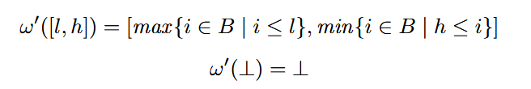

# tipc-passes

## 题目

1. 基于TIP语言的widening区间分析

## 原始代码解读


## 实验代码简述

### widening narrowing算法框架

在执行分析算法时，会执行几个步骤：
1. `collectInts`收集程序中的常整数集合
2. 初始化数据流状态以及worklist
3. 使用worklist算法对数据流状态进行变更。首先会使用widening版本迁移函数进行状态计算。到达不动点之后，再进行narrowing操作，即使用原始版本的迁移函数，不在完成状态计算之后做widen操作。

以下是具体细节：

首先通过`collectInts`收集指令中的常整数，作为widening区间的整数间隔值。即获取 B 集合（这里为`knownInts`变量）。

> 注意这里`knownInts`集合在[Pass初始化](../src/intervalrangepass/IntervalRangeAnalysis.h#L25)时就加入了+inf和-inf，这是为了方便后续widening操作的计算。

```cpp
  // Initialize known ints in F
  for (auto& bb : F) {
    for (auto&& i: bb) {
      if (isSupported(i)) {
        collectInts(&i);
      }
    }
  }
```

worklist算法被替换替换为lambda函数，其参数`useWiden`用于配置是否在worklist算法中启用widening。

```cpp
  auto worklist = [&](bool useWiden){
      // Iterate until the worklist is empty
      while (!w.empty()) {
        // Remove the current instruction
        Instruction* i = w.front(); 
        w.pop_front();

        // Record prior value to control worklist insertion
        auto old = state.lookup(i);
        Interval current = interval::empty();

        // use transfer function
        runOnInst(i, state, current, old, useWiden);

        // add users of this instruction to worklist only if the value has changed
  };
```

迁移函数被提取为一个函数`runOnInst`，可以通过`useWiden`配置是否在执行`f`转移函数之后进行widening操作。具体来说：在[runOnInst 160行](../src/intervalrangepass/IntervalRangeAnalysis.cpp#L160)中通过`widen`函数进行widening。

在widening迁移函数迭代到不动点之后，需要重新构建worklist，然后进行narrowing。如[IntervalRangeAnalysis.cpp#L263](../src/intervalrangepass/IntervalRangeAnalysis.cpp#L263)所示。

```cpp
  // widening
  worklist(true);

  // push again the supported instructions to the worklist
  for (BasicBlock& bb : F) {
    for (Instruction& i : bb) {
      if (isSupported(i)) {
        w.push_back(&i);
      }
    }
  }
  // narrowing
  worklist(false);
```

### widening

widening算法按照以下公式计算。



其实现如[Interval.cpp#L222](../src/intervalrangepass/Interval.cpp#L222)所示。

```cpp
Interval interval::widen(Interval in, std::set<int> &knownInts) {
  int new_left = pinf;
  int new_right = minf;
  
  for (auto iter = knownInts.rbegin(); iter != knownInts.rend(); iter++) {
    if (*iter <= lower(in)) {
      new_left = *iter;
      break;
    }
  }
  for (auto i: knownInts) {
    if (i >= upper(in)) {
      new_right = i;
      break;
    }
  }
  return make(new_left, new_right);
}
```

其中 $\bot$ 在框架中使用`[+inf, -inf]`表示，使用`widen`函数之后还会得到`[+inf, -inf]`。

### 迁移函数修复

> 定义：以下使用`l.1`表示区间l的左部，`l.2`表示区间l的右部。

框架提供的迁移函数在二元运算上的迁移函数不太精确。主要问题在于[`mul`](../src/intervalrangepass/Interval.cpp#L127)和[`div`](../src/intervalrangepass/Interval.cpp#L142)函数的处理上存在不精确的情况。

在`mul(l, r)`部分，在没有溢出的情况下，计算结果`res`的左部为`l.1*r.1`, `l.1*r.2`, `l.2*r.1`, `l.2*r.2`的最小值，右部为最大值。如果发生溢出，则区间的左部和右部使用`-inf`, `+inf`。

```cpp
Interval interval::mul(Interval l, Interval r) {
  if (l == empty() || r == empty() || l == full() || r == full())
    return full();
  std::set<int> s{};
  multiply_with_overflow_check(lower(l), lower(r), s);
  multiply_with_overflow_check(upper(l), lower(r), s);
  multiply_with_overflow_check(lower(l), upper(r), s);
  multiply_with_overflow_check(upper(l), upper(r), s);
  int low = *std::min_element(s.begin(), s.end());
  int high = *std::max_element(s.begin(), s.end());
  return make(low, high);
}
```

`div(l, r)`更加复杂。对于`l`, `r`中任一区间为 $\bot, \top$ 的情况，直接返回 $\top$ 进行保守处理。剩余情况按照如下方式处理。其中+,-表示数的正负情况。对于`r`是`[0,a]`,`[a,0]`的情况，分别处理为`[1,a]`,`[a,-1]`，然后分别按照`[+,+]`,`[-,-]`处理。对于`r`是`[-,+]`的情况，假设`r`可能为`-1, +1`，从而会有对应的`l/r`结果。


## 测试方式与测试结果

构建docker镜像与创建容器步骤:

```bash
docker build -t lslightly2357/tipc --network=host .
docker run -dit --tty --name tipc --network host lslightly2357/tipc
docker exec -it tipc /bin/bash
```

进入容器后

```bash
cd /tip/tipc-passes/src/intervalrangepass/
pytest interval_test.py # 执行irpass，得到.irpass与.expected进行比对
```

`test_interval`比对分为IR比对和区间分析结果比对。
- 区间分析结果是输出行的set集合。通过set集合进行比较。使用set比较的原因state map输出乱序
- IR比对采用字符串比对。

[interval_test.py](../src/intervalrangepass/interval_test.py)中还包含`test_ints`测试，主要用于测试从程序中抽取得到的整数，与测试无关。

添加的测试[interval6.tip](../src/intervalrangepass/test/interval6.tip)为书本84页测例。

测试结果为全部通过。


## 实验困难记录

在使用Catch测试框架的时候，不能将测试代码和`add_llvm_library`宏放在同一个CMakeLists.txt中，否则会出现找不到头文件的情况。需要重新定义`add_library`并在`target_link_libraries`中链接这个库。讨论见[link](https://discourse.llvm.org/t/how-to-link-library-created-by-add-llvm-library-to-googletest-catch2/83941/6?u=lslightly)。

现在将单元测试放在[../src/test/](../src/test/)下。
